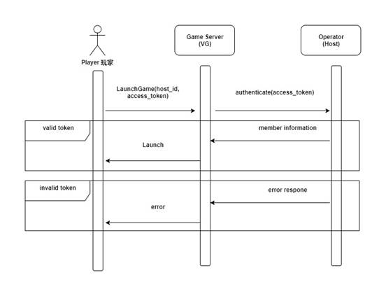

# Common Wallet 共享钱包

## Overview 概述

This document describes the service integration between **Gaming (provider)** and an **operator**. The following chapters describe the general concept of integration as well as descriptions and examples of the API methods used for the service integration.<b>
文档介绍了游戏供应商和对接第三方之间的技术接口细节。以下描述了游戏和第三方的一般概念，以及运用接口的描述和示例。

### General Notes 一般注意事项

- Data Format: JSON (JavaScript Object Notation)
- 数据格式: JSON (JavaScript Object Notation)
<br>
- Wallet Option: Common Wallet (a.k.a. Seamless Wallet)
- 电子钱包选项 : 共享钱包 
<br>
- **Operator** - Referred as the operator
- **第三方** - 被称为运营商或第三方
<br>
- **Provider** - Referred as the game provider
- **游戏供应商** - 被称为游戏供应商
<br>
- **Host ID** - This Host ID is an unique token generated from game provider for each game operator 
- **Host ID** - Host ID是游戏供应商为每个第三方提供的唯一令牌
<br>
- **Points** - Referred as the game points; not player's actual wallet balance.
- **Points** - Points是游戏点数；不是玩家的实际钱包余额.
<br>
- The operator manages the user account database (personal information, balance, wallet operations, etc.)
- 游戏第三方管理用户帐户数据库(个人资料, 余额, 钱包操作等.)
<br>
- The provider only manages the player data necessary to perform game operation.
- 游戏供应商仅管理游戏操作所需和玩家数据
<br>
- All methods support uses **HTTPS GET** verb in the system.
- 全部请求内容必须使用 HTTPS GET 调用
<br>
- Players perform all betting and gaming by using Operator's wallet system. Therefore, **operator** need to develop and integrate VG API .
- 玩家使用VG Game Server的钱包系统执行所有投注和游戏。因此,**第三方**需要连接VG API。


### Getting started 游戏接入规范

To be able to connect to our game server, **operator** needs to provide the following API for us to communicate between game server and operator site. Players perform all betting and gaming by using operator's own wallet system.<b>
为了能够连接到我们的VG游戏服务器。 **第三方**需要提供以下API给我们在游戏服务器和第三方之间进行链接。玩家使用VG Game Server的钱包系统执行所有投注和游戏。

- [Authenticate 认证 (O)](#authenticate-认证)
- [Bet 下注 (O)](#bet-下注)
- [Result 成绩 (O)](#result-成绩)
- [Refund Bet 退款 (O)](#refund-bet-退款)
- [Bet and Win 下注赢利 (O)](#bet-and-win-下注赢利)
- [Game List 游戏列表](#game-list-游戏列表)
- [Game Launch 游戏启动](#game-launch-游戏启动)
- [User Report 玩家报表](#user-report-玩家报表)

\*\*(O) is referred to API that is required to be develop by operator.
<b> \*\*(O) 是指第三方必须开发的API。

### Game Launch Process 游戏启动流程

- When a player launches the game, it will call the **Operator's Authenticate** API.
- 当玩家启动游戏时，将调用**第三方 Authenticate** API.
<br>
- Operator needs to provide us the **Authenticate** API.
- 第三方需要向我们提供 **Authenticate** API。
<br>
- The **Authenticate** API is used by VG Game Server to retrieve players' information from the operator.
- VG 游戏服务器使用 **Authenticate** API 来检索第三方玩家的信息。
<br>
- Authenticate API is called upon launching the game for the logged-in player.
- 已登录玩家启动游戏时会调用Authenticate API。
<br>


---

## API 游戏程序接口参考

### Authenticate 认证

Authenticate API is called upon launching the game for the logged-in player. **Operator needs to implement this API for user verification**.<b>
已登录玩家启动游戏时会调用Authenticate API。**第三方需要实施此API进行用户验证。**

<!--
type: tab
title: Docs 文件
-->

### Request 请求

| Name 名称    | Type 类型   | Description 介绍                                                                     |
| ------------ | ------ | ------------------------------------------------------------------------------ |
| access_token | string | The access token is generated by operator system for the player’s session. <b>玩家在第三方系统内的访问令牌  |
| game_code    | string | Game code is referred to [Game List](#game-list-游戏列表) API<b>游戏代码可参考[游戏列表](#game-list-游戏列表) API                                                                      |

> ##### Example 例子
>
> <https://{OPERATOR_API_ENDPOINT}/api/user/authenticate?access_token={access_token}&game_code=fish>

### Response 响应

| Name   名称     | Type  类型 | Description   介绍                                                                          |
| ----------- | ------ | --------------------------------------------------------------------------------------- |
| status_code | int    | Response status code<b>响应状态代码                                                                    |
| member_id   | string | Unique ID of the player<b>玩家唯一ID                                                                 |
| balance     | uint64 | Current **Balance** of the player (in cents)<b>玩家现有的点数 (进位两位数，分钱)                                            |
| currency    | string | Currency code is referred to ISO 4217<b>货币代码可参考ISO 4217                                                                          |

#### Status Code 状态代码

| Code 代码 | Description 介绍  |
| ---- | ------------- |
| 0    | Success<b>成功       |
| 1    | Invalid Token<b>访问令牌无效 |

<!--
type: tab
title: Examples 例子
-->

### Sample Success Response 成功响应例子

```json
{
  "status_code": 0,
  "member_id": "demo01",
  "balance": 100000,
  "currency": "MYR"
}
```

### Sample Error Response 错误响应例子

```json
{
  "status_code": 1,
  "message": "Invalid Token"
}
```

<!--
type: tab
title: Try It 尝试
-->

```json http
{
  "method": "get",
  "url": "https://{OPERATOR_API_ENDPOINT}/api/user/authenticate",
  "query": {
    "access_token": "{access_token}",
    "game_code": "fish"
  }
}
```


<!-- type: tab-end -->

---

### Bet 下注

When the game places a bet, it will call  **Operator's API** to deduct player's wallet. **Operator needs to implement this API for betting operation**.<b>
当玩家下注时，游戏会调用**第三方API**来扣除玩家的钱包。**第三方需要实施此API进行投注操作。**

<!--
type: tab
title: Docs 文件
-->

### Request 请求

| Name   名称      | Type 类型  | Description   介绍                                                                 |
| ------------ | ------ | ------------------------------------------------------------------------------ |
| access_token | string | The access token is generated by operator system for the player's session.<b>玩家在第三方系统内的访问令牌。
 |
| ticket_id    | uint64 | Unique ID of the transaction on the Operator side.<b>第三方交易的唯一ID。                             |
| total_bet    | uint64 | Total betting **POINTS** (in Cents)<b>总下注**点数**(进位两位数，分钱）                                            |
| key          | string | Bet type of the betting trade<b>下注交易的下注类型                                                  |
| game_code    | string | Game code is referred to [Game List](#game-list)API<b>游戏代码可参考[游戏列表](#game-list-游戏列表) API                                                        |

> ##### Example 例子
>
> <https://{OPERATOR_API_ENDPOINT}/api/bet?access_token={access_token}&ticket_id={ticket_id}&total_bet={total_bet}&key={key}&game_code={game_code}>

### Response 响应

| Name 名称       | Type 类型  | Description  介绍                                                                          |
| ----------- | ------ | -------------------------------------------------------------------------------------- |
| status_code | int    | Response status code<b>响应状态代码                                                                   |
| balance     | uint64 | Current **POINTS** of the player (in cents)<b>玩家现有的**点数**(进位两位数，分钱)                                            |

#### Status Code 状态代码

| Code 代码 | Description 介绍           |
| ---- | ---------------------- |
| 0    | Success<b>成功                |
| 1    | Invalid Token<b>访问令牌无效          |
| 2    | Invalid Transaction ID<b>交易单号无效 |
| 3    | Insufficient Funds<b>资金不足     |

<!--
type: tab
title: Examples 例子
-->

### Sample Success Response 成功响应例子

```json
{
  "status_code": 0,
  "balance": 100000
}
```

### Sample Error Response 错误响应例子

```json
{
  "status_code": 1,
  "message": "Invalid token"
}
```

<!--
type: tab
title: Try It 尝试
-->

```json http
{
  "method": "get",
  "url": "https://{OPERATOR_API_ENDPOINT}/api/bet",
  "query": {
    "access_token": "{access_token}",
    "ticket_id": "{ticket_id}",
    "total_bet": 10000,
    "key": "{key}",
    "game_code": "{game_code}"
  }
}
```

<!-- type: tab-end -->

### Result 成绩

When the game provider has the result return, it will call Result API. This  API will be called despite a winning bet or losing bet. If it’s a losing bet, the total win is return as 0. Otherwise, the total win amount will be returned. **Operator needs to implement this API for each bet result**.<b>
当游戏供应商返回结果时，它将调用Result API。无论赢还是输，都会调用此API。如果是下注，则总赢数将返回0。否则，将返回总赢金额。**第三方需要针对每个下注结果实施此API**。

<!--
type: tab
title: Docs 文件
-->

### Request 请求

| Name  名称       | Type  类型 | Description  介绍                                                                                                                                                                                                                                                                      |
| ------------ | ------ | ---------------------------------------------------------------------------------------------------------------------------------------------------------------------------------------------------------------------------------------------------------------------------------- |
| access_token | string | The access token is generated by operator system for the player's session.<b>玩家在第三方系统内的访问令牌。                                                                                                                                                                                                     |
| ticket_id    | uint64 | Unique ID of the transaction on the Operator side.<b>第三方交易的唯一ID。                                                                                                                                                                                                                                 |
| total_win    | uint64 | Total winning **POINTS** (in Cents)<b>总赢**点数**（进位两位数，分钱）                                                                                                                                                                                                                                                |
| game_code    | string | Game code is referred to [Game List](#game-list) API<b>游戏代码可参考[游戏列表](#game-list-游戏列表)API                                                                                                                                                                                                                                                          |
| total_used   | uint64 | (Optional) _This is an additional parameter that will only present in action games (i.e. Blue Ocean, Safari Hunter, and Bird of Paradise)._</b>(选择性)_这是一个仅在动作游戏中显示的附加参数（例如，蓝海龙王，黄金猎人和捕鸟天堂）。_ </b> <br>Total **POINTS** used (in Cents) in action games.</b>动作游戏中使用的总**点数**(进位两位数，分钱）。</b> <br> This field records how much credit a player has used in the action game. </b>这些记录玩家在动作游戏中使用了多少钱币。</b>|

> ##### Example 例子
>
> <https://{OPERATOR_API_ENDPOINT}/api/result?access_token={access_token}&ticket_id={ticket_id}&total_win={total_win}&game_code={game_code}>

### Response 响应

| Name  名称      | Type 类型  | Description  介绍                                                                          |
| ----------- | ------ | -------------------------------------------------------------------------------------- |
| status_code | int    | Response status code <b>响应状态代码                                                                  |
| balance     | uint64 | Current **POINTS** of the player (in cents)<b>玩家现有的**点数** (进位两位数，分钱)                                            |

#### Status Code 状态代码


| Code 代码 | Description  介绍          |
| ---- | ---------------------- |
| 0    | Success <b>成功               |
| 1    | Invalid Token <b>访问令牌无效          |
| 2    | Invalid Transaction ID <b>交易单号无效 |

<!--
type: tab
title: Examples 例子
-->

### Sample Success Response 成功响应例子

```json
{
  "status_code": 0,
  "balance": 100000
}
```

### Sample Error Response 错误响应例子

```json
{
  "status_code": 1,
  "message": "Invalid token"
}
```

<!--
type: tab
title: Try It 尝试

-->

```json http
{
  "method": "get",
  "url": "https://{OPERATOR_API_ENDPOINT}/api/result",
  "query": {
    "access_token": "{access_token}",
    "ticket_id": "{ticket_id}",
    "total_win": 10000,
    "game_code": "{game_code}"
  }
}
```

<!-- type: tab-end -->

### Refund Bet 退回下注

This API is called to cancel the latest Bet if system error occurred. **Operator needs to implement this API for refund purpose**.<b>如果发生系统错误，则调用此API来取消最新的下注。第三方需要实施此API以进行退款。


<!--
type: tab
title: Docs 文件
-->

### Request 响应

| Name 名称        | Type 类型  | Description 介绍                                                                   |
| ------------ | ------ | ------------------------------------------------------------------------------ |
| access_token | string | The access token is generated by operator system for the player's session.<b>玩家在第三方系统内的访问令牌。 |
| ticket_id    | uint64 | Unique ID of the transaction on the Operator side.<b>第三方交易的唯一ID。                             |
| game_code    | string | Game code is referred to [Game List](#game-list) API <b>游戏代码可参考 [游戏列表](#game-list-游戏列表)API                                                    |

> ##### Example 例子
>
> <https://{OPERATOR_API_ENDPOINT}/api/refund?access_token={access_token}&ticket_id={ticket_id}&game_code={game_code}>

### Response 响应

| Name 名称       | Type  类型  | Description 介绍                                                                           |
| ----------- | ------ | -------------------------------------------------------------------------------------- |
| status_code | int    | Response status code<b>响应状态代码                                                                   |
| balance     | uint64 | Current **POINTS** of the player (in cents)<b>玩家现有的**点数** (进位两位数，分钱)                                            |

#### Status Code 状态代码 

| Code 代码 | Description 介绍           |
| ---- | ---------------------- |
| 0    | Success <b>成功               |
| 1    | Invalid Token <b>访问令牌无效         |
| 2    | Invalid Transaction ID <b>交易单号无效 |

<!--
type: tab
title: Examples 例子
-->

### Sample Success Response 成功响应例子

```json
{
  "status_code": 0,
  "balance": 100000
}
```

### Sample Error Response 错误响应例子

```json
{
  "status_code": 1,
  "message": "Invalid token"
}
```

<!--
type: tab
title: Try It 尝试
-->

```json http
{
  "method": "get",
  "url": "https://{OPERATOR_API_ENDPOINT}/api/refund",
  "query": {
    "access_token": "{access_token}",
    "ticket_id": "{ticket_id}",
    "game_code": "{game_code}"
  }
}
```

<!-- type: tab-end -->

### Bet and Win 下注和赢

This API is used for slot games. The game will call this **Operator API** to deduct or deposit their wallet. **_Operator needs to implement this API for slot games purpose_**.<b>此API用于老虎机游戏。游戏将调用此**Operator API**扣除或存入其钱包。**_第三方需要此API用于老虎机游戏_**。

<!--
type: tab
title: Docs 文件
-->

### Request 请求

| Name 名称         | Type 类型  | Description 介绍                                                                   |
| ------------ | ------ | ------------------------------------------------------------------------------ |
| access_token | string | The access token is generated by operator system for the player's session.<b>玩家在第三方系统内的访问令牌。 |
| ticket_id    | uint64 | Unique ID of the transaction on the Operator side.<b>第三方交易的唯一ID。                             |
| total_bet    | uint64 | Total betting **POINTS** (in Cents)<b>总下注**点数** （进位两位数，分钱）                                            |
| total_win    | uint64 | Total winning **POINTS** (in Cents)<b>总赢**点数** （进位两位数，分钱）                                            |
| game_code    | string | Game code is referred to [Game List](#game-list) API<b>游戏代码可参考[游戏列表](#game-list-游戏列表)API                                                        |

> ##### Example 例子
>
> <https://{OPERATOR_API_ENDPOINT}/api/betwin?access_token={access_token}&ticket_id={ticket_id}&total_bet={total_bet}&total_win={total_win}&game_code={game_code}>

### Response 响应

| Name 名称       | Type  类型  | Description 介绍                                                                           |
| ----------- | ------ | -------------------------------------------------------------------------------------- |
| status_code | int    | Response status code <b>响应状态代码                                                                   |
| balance     | uint64 | Current **POINTS** of the player (in cents) <b>玩家现有的**点数** (进位两位数，分钱)                                           |

#### Status Code 状态代码

| Code 代码 | Description 介绍           |
| ---- | ---------------------- |
| 0    | Success<b>成功                |
| 1    | Invalid Token <b>访问令牌无效          |
| 2    | Invalid Transaction ID <b>交易单号无效|
| 3    | Insufficient Funds<b>资金不足     |

<!--
type: tab
title: Examples 例子
-->

### Sample Success Response 成功响应例子

```json
{
  "status_code": 0,
  "balance": 100000
}
```

### Sample Error Response 错误响应例子

```json
{
  "status_code": 1,
  "message": "Invalid token"
}
```

<!--
type: tab
title: Try It 尝试
-->

```json http
{
  "method": "get",
  "url": "https://{OPERATOR_API_ENDPOINT}/api/betwin",
  "query": {
    "access_token": "{access_token}",
    "ticket_id": "{ticket_id}",
    "total_bet": "{total_bet}",
    "total_win": "{total_win}",
    "game_code": "{game_code}"
  }
}
```

<!-- type: tab-end -->

## Game List 游戏列表 

This api will return game list to operator.<b>这API将游戏列表返回给第三方。

<!--
type: tab
title: Docs 文件
-->

### Request 请求 

| Name 名称   | Type 类型  | Description 介绍                                          |
| ------- | ------ | ---------------------------------------------------- |
| host_id | string | Unique ID of Operator System (provided by game provider)<b>第三方的Host ID (游戏供应商提供) |

> ##### Example 例子
>
> <https://{PROVIDER_API_ENDPOINT}/api/user/gamelist?host_id={host_id}>

### Response 响应

| Name 名称       | Type 类型 | Description 介绍         |
| ----------- | ----- | -------------------- |
| status_code | int   | Response status code<b>响应状态代码 |
| list        | array | A list of game list<b>游戏列表  |

#### Status Code 状态代码

| Code 代码 | Description 介绍                   |
| ---- | ------------------------------ |
| 0    | Success <b>成功                       |
| 2    | Invalid Host ID <b>Host ID 无效               |
| 2001 | Required field cannot be empty <b>必填字段不能为空|

<!--
type: tab
title: Examples 例子
-->

### Sample Success Response 成功响应例子

```json
{
  "data": {
    "status_code": 0,
    "list": [
      {
        "title": {
          "en": "Blue Ocean",
          "cn": "蓝海龙王"
        },
        "game_id": "shoot-01",
        "game_code": "fish",
        "lobby_group": "shooting",
        "url": "https://shoot-01.velachip.com"
      }
    ]
  }
}
```

### Sample Error Response 错误响应例子

```json
{
  "error": {
    "status_code": 2,
    "message": "Invalid Host ID",
    "retry": null
  }
}
```

<!--
type: tab
title: Try It 尝试
-->

```json http
{
  "method": "get",
  "url": "https://{PROVIDER_API_ENDPOINT}/api/user/gamelist",
  "query": {
    "host_id": "{host_id}"
  }
}
```

<!-- type: tab-end -->

## Game Launch 游戏启动

For launching games, please refer to the URL parameters as below. The game URL is referred to [Game List](#game-list) reponse.<b>要启动游戏，请参考以下URL参数.游戏URL可参考游戏列表响应

<!--
type: tab
title: Docs 文件
-->

### Request 请求

| Name 名称          | Type 类型  | Description 介绍                                                                       |
| -------------- | ------ | ----------------------------------------------------------------------------------- |
| host_id        | string | Unique ID of Operator System (provided by game provider)<b> 第三方的 Host ID (游戏供应商提供)                                |
| access_token   | string | The access token is generated by operator system for the player's session.<b>玩家在第三方系统内的访问令牌。      |
| mode           | string | Game mode</b>游戏模式 <br> (singleplayer, multiplayer)</b>(单机版或多人版 ) <br> \*\*only required for action game<b>\*\*只适于射击游戏   |
| lang           | string | Language of the game (ch, en)</b>游戏语言(ch, en) <br> Default language is en<b>默认语言是en                           |
| allow_vertical | int    | Default is 1</b>默认是1 <br> 0 - landscape mode</b>0 - 横向模式 <br> 1 - allow vertical mode and landscape mode<b>1 - 允许垂直模式和横向模式 |

> If host_id and access_token is not provided, it is treated as **Guest** mode.<b>如果没有提供host_id和access_token，将会被视为游客模式 。

> ##### Example 例子
>
> <https://{GAME_URL}?host_id={host_id}&access_token={access_token}&mode=singleplayer&lang=ch&allow_vertical=1>

<!-- type: tab-end -->

## User Report 玩家报表

This API is called to retrieve the game report from Game Server. **Operator** must maintain the key to keep track log request. For the first time to request log, key = 0. The response return the key value to **operator** for the next log request.<b>游戏供应商内的游戏数据报表，**第三方可**用此接口获得数据。玩家报表会根据 **第三方**所返回的据库索引号 来寻找数据

<!--
type: tab
title: Docs 文件
-->

### Request 请求

| Name 名称    | Type 类型  | Description 介绍                                         |
| ------- | ------ | ---------------------------------------------------- |
| host_id | string | Unique ID of Operator System (provided by game provider)<b>第三方的Host ID (游戏供应商提供)
 |
| key     | string | Unique database index number<b>数据库索引号                         |
| page_size | int(optional) | Number of records. Maximum 500 <b>记录的数量. 最大值500|

> If key is empty, it will return data from index zero (0).<b>如果没有提供数据库索引号，供数据库索引号将会被视为初始值为 0。<b>
If page_size is empty, default return 10 records.<b>
如果没有提供page_size,默认返回10个记录


> ##### Example 例子
>
> <https://{PROVIDER_API_ENDPOINT}/api/report?host_id={host_id}&key={key}&page_size={page_size}>

### Response 响应

| Name 名称       | Type 类型 | Description  介绍        |
| ----------- | ----- | -------------------- |
| status_code | int   | Response status code<b>响应状态代码 |
| report      | array | A list report<b>报表列表        |

#### Status Code 状态代码

| Code 代码 | Description 介绍    |
| ---- | --------------- |
| 0    | Success<b>成功         |
| 2    | Invalid Host ID<b>Host ID 无效 |

#### Report 报表

| Name 名称         | Type 类型  | Description 介绍|
| ------------- | ------ | --------------- |
| id            | int    | Id              |
| ticket_id     | int    | Ticket Id       |
| game_code     | string | Game code is referred to [Game List](#game-list-游戏列表) API       |
| game_group    | string | Game group      |
| username      | string | Player username |
| bet_stake     | double | Bet stake       |
| commission    | double | Commission      |
| bet_info      | array  | Bet info        |
| result_info   | array  | Result info     |
| payout_amount | double | Payout amount   |
| gain_amount   | double | Gain amount     |
| loss_amount   | double | Loss amount     |
| draw_amount   | double | Draw amount     |
| cancel_amount | double | Cancel amount   |
| reject_amount | double | Reject amount   |
| status        | string | Status          |
| report_date   | date   | Report date     |

<!--
type: tab
title: Examples 例子 
-->

### Sample Success Response 成功响应例子

```json
{
  "data": {
    "status_code": 0,
    "report": [
      {
        "id": "4",
        "ticket_id": "2192",
        "game_code": "fish",
        "code": "fish",
        "game_group": "action",
        "username": "demo04",
        "bet_stake": 10000,
        "commission": 0,
        "bet_info": {
          "room_type": "room x1"
        },
        "result_info": {
          "total_bullet_cost": 3,
          "total_fish_payout": 0
        },
        "payout_amount": 9997,
        "gain_amount": 0,
        "loss_amount": 3,
        "draw_amount": 0,
        "cancel_amount": 0,
        "reject_amount": 0,
        "data": null,
        "status": "done",
        "remark": null,
        "report_date": "2017-07-31 17:38:10"
      }
    ],
    "key": "13",
    "version_key": "13"
  }
}
```

### Sample Error Response 错误响应例子

```json
{
  "error": {
    "status_code": 2,
    "message": "Invalid Host ID"
  }
}
```

<!--
type: tab
title: Try It 尝试
-->

```json http
{
  "method": "get",
  "url": "https://{PROVIDER_API_ENDPOINT}/api/report",
  "query": {
    "host_id": "{host_id}",
    "key": "{key}"
  }
}
```

<!-- type: tab-end -->
