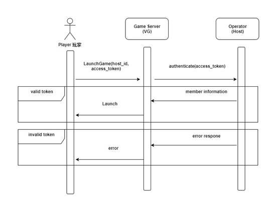

# Mini Game

## Overview

This document describes the service integration between **Gaming (provider)** and an **operator**. The following chapters describe the general concept of integration as well as descriptions and examples of the API methods used for the service integration.

### General Notes

- Data Format: JSON (JavaScript Object Notation)
- **Operator** - Referred as the operator
- **Provider** - Referred as the game provider
- **Host ID** - This Host ID is an unique token generated from game provider for each game operator
- The operator manages the user account database (personal information, coin balance, etc.)
- The provider only manages the player data necessary to perform game operation.
- All methods support uses **HTTPS GET** verb in the system.
- Players perform all game by using Operator's players info system. Therefore, **operator** need to develop and integrate VG API .

### Getting started

To be able to connect to our game server, **operator** needs to provide the following API for us to communicate between game server and operator site. Players perform game by using operator's own players info system.

- [Authenticate (O)](#authenticate)
- [Result (O)](#result)
- [Game List](#game-list)
- [Game Launch](#game-launch)

> (O) is referred to API that is required to be develop by operator.

### Game Launch Process

- When a player launches the game, it will call the **Operator's Authenticate** API.
- Operator needs to provide us the **Authenticate** API.
- The **Authenticate** API is used by VG Game Server to retrieve players' information and the expected result from the operator.
- Authenticate API is called upon launching the game for the logged-in player.



---

## API

### Authenticate

Authenticate API is called upon launching the game for the logged-in player. **Operator needs to implement this API for user verification**.

<!--
type: tab
title: Docs
-->

### Request

| Name         | Type   | Description                                                                |
| ------------ | ------ | -------------------------------------------------------------------------- |
| access_token | string | The access token is generated by operator system for the player’s session. |
| game_code    | string | Game code is referred to [Game List](#game-list) API                       |
| min_score    | int    | Minimum score per coin                                                     |
| max_score    | int    | Maximum score per coin                                                     |

> ##### Example
>
> https://{OPERATOR_API_ENDPOINT}/api/user/authenticate?access_token={access_token}&game_code={game_code}&min_score=5&max_score=100

### Response

| Name            | Type   | Description                                                                                                                                     |
| --------------- | ------ | ----------------------------------------------------------------------------------------------------------------------------------------------- |
| status_code     | int    | Response status code.                                                                                                                           |
| member_id       | string | Unique ID of the player.                                                                                                                        |
| coin_balance    | int    | Number of games to be played for this session.                                                                                                  |
| expected_result | int    | Total score to be gain by the player <br> **expected_result** must fall between **min_score \* coin_balance** and **max_score \* coin_balance** |
| currency        | string | Currency of thee player. <br> \*\*Please return a fixed value "COIN"                                                                            |

#### Status Code

| Code | Description   |
| ---- | ------------- |
| 0    | Success       |
| 1    | Invalid Token |

<!--
type: tab
title: Examples
-->

### Sample Success Response

```json
{
  "status_code": 0,
  "member_id": "demo01",
  "expected_result": 375,
  "coin_balance": 10,
  "currency": "COIN"
}
```

> The player will expected to gain total of 150 score in 10 games.

### Sample Error Response

```json
{
  "status_code": 1,
  "message": "Invalid Token"
}
```

<!--
type: tab
title: Try It
-->

```json http
{
  "method": "get",
  "url": "https://{OPERATOR_API_ENDPOINT}/api/users/authenticate",
  "query": {
    "access_token": "{access_token}",
    "game_code": "{game_code}",
    "min_score": 5,
    "max_score": 100
  }
}
```

<!-- type: tab-end -->

---

### Result

When the game provider has the result return, it will call Result API. The score gained by player for that game will be returned. **Operator needs to implement this API for each game result**.

<!--
type: tab
title: Docs
-->

### Request

| Name         | Type   | Description                                                                |
| ------------ | ------ | -------------------------------------------------------------------------- |
| access_token | string | The access token is generated by operator system for the player's session. |
| session_id   | uint64 | Unique ID of the game session on the Operator side.                        |
| game_code    | string | Game code is referred to [Game List](#game-list) API.                      |
| score        | uint64 | Score gained by the player for that game.                                   |
| total_score  | uint64 | Accumulated score gained by the player for that session.                    |
| status       | int    | Player game status                                                         |

#### Status

| Code | Description |
| ---- | ----------- |
| 0    | Playing     |
| 1    | Done        |
| 2    | Disconnect  |

> ##### Example
>
> https://{OPERATOR_API_ENDPOINT}/api/result?access_token={access_token}&session_id={session_id}&game_code={game_code}&score=5&total_score=50&status=0

### Response

| Name         | Type | Description                                              |
| ------------ | ---- | -------------------------------------------------------- |
| status_code  | int  | Response status code                                     |
| coin_balance | int  | Remaining number of games to be played for this session. |

#### Status Code

| Code | Description            |
| ---- | ---------------------- |
| 0    | Success                |
| 1    | Invalid Token          |
| 2    | Invalid Transaction ID |

<!--
type: tab
title: Examples
-->

### Sample Success Response

```json
{
  "status_code": 0,
  "coin_balance": 9,
  "member_id": "demo01",
  "currency": "COIN"
}
```

### Sample Error Response

```json
{
  "status_code": 1,
  "message": "Invalid token"
}
```

<!--
type: tab
title: Try It
-->

```json http
{
  "method": "get",
  "url": "https://{OPERATOR_API_ENDPOINT}/api/result",
  "query": {
    "access_token": "{access_token}",
    "session_id": "{session_id}",
    "game_code": "{game_code}",
    "score": "5",
    "total_score": "50",
    "status": "0"
  }
}
```

<!-- type: tab-end -->

## Game List

This api will return game list to operator.

<!--
type: tab
title: Docs
-->

### Request

| Name    | Type   | Description                                              |
| ------- | ------ | -------------------------------------------------------- |
| host_id | string | Unique ID of Operator System (provided by game provider) |

> ##### Example
>
> https://{PROVIDER_API_ENDPOINT}/api/user/gamelist?host_id={host_id}

### Response

| Name        | Type  | Description          |
| ----------- | ----- | -------------------- |
| status_code | int   | Response status code |
| list        | array | A list of game list  |

#### Status Code

| Code | Description                    |
| ---- | ------------------------------ |
| 0    | Success                        |
| 2    | Invalid Host ID                |
| 2001 | Required field cannot be empty |

<!--
type: tab
title: Examples
-->

### Sample Success Response

```json
{
  "data": {
    "status_code": 0,
    "list": [
      {
        "title": {
          "en": "Wheel of Lady Luck",
          "cn": "幸运女神"
        },
        "game_id": "mg-01",
        "game_code": "mg-01",
        "lobby_group": "MINI",
        "url": "https://mg-01.velachip.com"
      }
    ]
  }
}
```

### Sample Error Response

```json
{
  "error": {
    "status_code": 2,
    "message": "Invalid Host ID",
    "retry": null
  }
}
```

<!--
type: tab
title: Try It
-->

```json http
{
  "method": "get",
  "url": "https://{PROVIDER_API_ENDPOINT}/api/user/gamelist",
  "query": {
    "host_id": "{host_id}"
  }
}
```

<!-- type: tab-end -->

## Game Launch

For launching games, please refer to the URL parameters as below. The game URL is referred to [Game List](#game-list) reponse.

<!--
type: tab
title: Docs
-->

### Request

| Name         | Type   | Description                                                                |
| ------------ | ------ | -------------------------------------------------------------------------- |
| host_id      | string | Unique ID of Operator System (provided by game provider)                   |
| access_token | string | The access token is generated by operator system for the player's session. |

> ##### Example
>
> https://{GAME_URL}?host_id={host_id}&access_token={access_token}

<!-- type: tab-end -->
